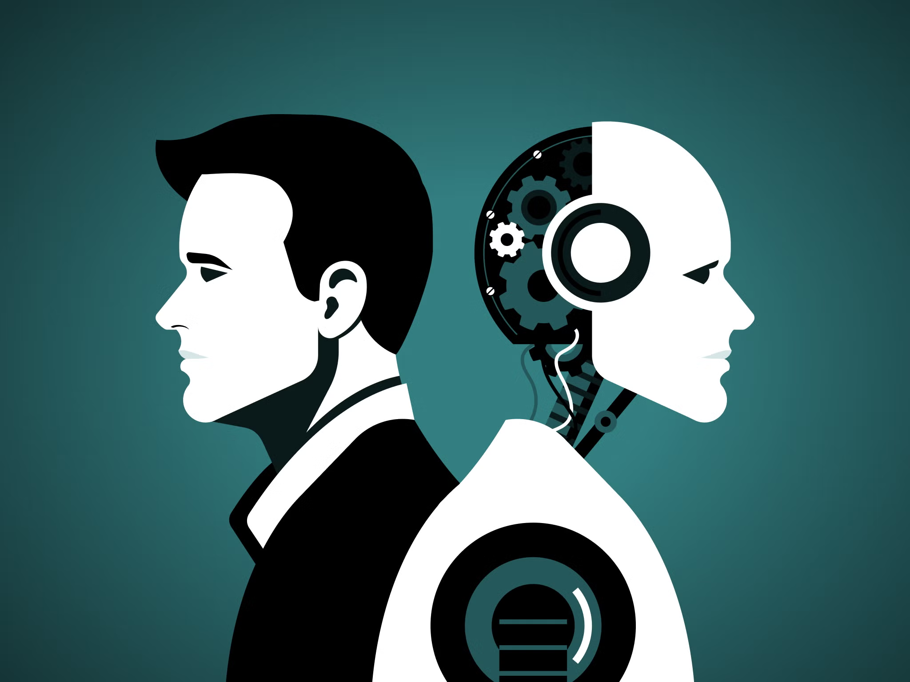

### I. Introduction
Artificial intelligence, often shortened to AI, has made a huge splash in the technology scene as of late, expanding its reach out to the lives of most average people, even those not up to date with the most modern technologies. Of course, AI technology has been around for a long time already, and is very much not a new novel concept. However, with its explosion in popularity, the rate of its development, efficiency, and usage seems to have gone up exponentially. Most major companies have jumped at the notion and incorporated the tech into their software as a new visible feature to satisfy the consumer, such as Meta AI, Google Bard, Opera’s Aria, etc. 

The accessibility has allowed it to morph to fit vastly different molds; those with an interest in its potential have already begun tinkering with it to fit their wishes. Content creation, automation, management, personalized plans, etc. are all possible subjects and fields that show evidence of AI development already taking hold. The personalized feed that you see in your social media more often than not is picked out for you by AI. Some education systems take pride in the usage of AI-driven learning systems and auto-graders, and ChatBots for entertainment are growing more and more prevalent. As we get further into the future, there is little to no doubt that we will continue to see AI more and more often. 

### II. Personal Experience with AI:

In this course, and within my academic career so far, I have not used software such as ChatGPT or GitHub Co-Pilot. I will not say that I have not used AI at all, as AI is likely present in a lot of software that I use without me specifically noticing, such as Grammarly. For each of the below sections, I’ll give a little more in-depth reason as to why I chose to skip AI.

1. Experience WODs e.g. E18

I felt that there was no reason to use AI, as almost all of the exercises had a detailed video on the solution should I ever get stumped. I thought that it was very much important for me to find the answer myself and learn in preparation for the actual in-class WODs.
 
2. In-class Practice WODs

Again, I felt no reason to use AI since there were people to work with and ideas that could be shared if I got stumped. Even if I did not work with anyone, it was still extra practice for me to create a solution on my own. 

3. In-class WODs

The most common AI that I saw being used was ChatGPT. I’ve never used ChatGPT before, and during a quiz is hardly the time to try and learn the software. I felt like the quizzes were something to test my own ability, both to work under pressure and my knowledge in the material. I know that one could argue that using AI during the WOD would also test my ability to manipulate AI for answers, but it did not sit right with myself to use AI for a quiz, especially in the earlier ones where an answer would be so easy to get. In the later WODs, I also found the material a little easier, so I didn't need AI. It was also a matter of forcing myself to study and prepare rather than relying on ChatGPT the day of, which is something I knew I would do. I think in this way, I could attribute my successes to myself and myself only, and my failures to myself and myself only.

4. Essays

I might have used AI in some of my essays, if you count spell check and Grammarly. However, the words written in all of my essays are my own and of my own thought, none of which were generated by AI. I do enjoy writing and get into a writing zone often. I have a lot of thoughts to share, too many I would say, so I didn’t need AI to come up with ideas for me. I think I am also very particular about my way of writing, and it would take too long to tweak AI’s voice to fit my own.

5. Final project

I feel like I don’t really have a definitive answer as to why I did not use AI on the Final project other than I didn’t want to. I think our final projects were pretty specific, or at least the issues that I had trouble with were, and I didn’t think that AI would be able to give me a useful answer that I couldn’t just search around for myself. 

6. Learning a concept / tutorial

There are tons of forums, videos, documentation, and material out there that I used to learn something I had trouble with. They all served me well. so I stuck to that as my method and never felt the need to resort to AI. 

7. Answering a question in class or in Discord

I never really answered many questions on Discord unless I was absolutely sure about the right answer. Most times though, I had no idea what they were asking, and I didn’t want to pull up AI when they likely tried it themselves already. 

8. Asking or answering a smart-question

I don't think I asked many questions on Discord either, most of my issues were solved by searching around or just rebooting my PC. I’m not sure how I would use AI to ask my own questions, and answering my own questions with AI is not something that I have experience with, so I doubt that I could have helped someone else's question with AI.

9. Coding example e.g. “give an example of using Underscore .pluck”

There are tons of examples and documentation online, and they were always enough for me. I didn’t feel the need to use AI, and I have a somewhat irrational fear that AI would give me the wrong answer.

10. Explaining code

The code in this class was pretty clear to me. When it wasn’t, my previous professor taught me to draw diagrams and go line by line, keeping track of what is going on with the data and processes. Usually, that is enough for me to understand the code. If not, I could always ask classmates or the professor. I never thought to use AI.

11. Writing code

This is such a big portion of software engineering, and I felt it important to understand what I was doing. Not implying that using AI means you don’t understand anything, but repetitive exposure to writing code was my way to familiarize myself with what I was doing. I also heard that there are often many bugs in AI-generated code, and I prefer getting it right in the beginning or debugging my own code over anyone else’s. 

12. Documenting code

It was pretty easy to do by hand, I just didn’t see a reason to try and get AI to do it.

13. Quality assurance e.g. “What’s wrong with this code” or “Fix the ESLint errors in ...”

ESLint errors or just general errors were simple enough to fix based on the error message. When the message was too convoluted, I opted to search up the error and see the potential causes, or just use developer tools to observe where the error is. I thought of it as a practice for debugging. I know that AI would likely be able to finish it quickly, but I wanted the experience.

14. Other uses in ICS 314 not listed

I did not use AI elsewhere.

### III. Impact on Learning and Understanding:
AI has the potential to teach vast amounts of people a multitude of different skills and subjects, and can pump out solutions to difficult issues much quicker than a normal human can. It has the ability for nearly anything with just a little bit of prompting or adjusting. There is no wonder why it has become such a useful tool in many people’s daily lives. 

I know that my lack of use of AI generally makes my work less efficient than my peers, and with the rapid development of AI, I also know that it will one day be customary to use AI in daily software development. It is indeed a great tool with vast amounts of potential, yet there is still a part of me that wants to first create a foundation for myself, by myself before delving into AI. From what I have experienced so far in this class, I was able to handle not using AI, therefore I cannot say if it had enhanced or challenged my understanding of the software engineering concepts. My use of AI may change, or remain the same in the future. 

### IV. Practical Applications:
AI has been used in a myriad of different applications worldwide, in fields such as healthcare, agriculture, transportation, entertainment, etc. As we continue to develop this technology, AI will continue to find its solid place in every subject. In the scene of environmental sustainability, AI has been used to track pollution and climate changes, filter through images of rare wildlife and invasive species sightings to take care of the tedious tasks, leaving us more time to conduct fieldwork.

I think that it is an invaluable tool that can be adapted to daily life, but in the larger sense I also believe that it may still be too new of a technology; so new that our moral senses and logic have not yet caught up. In these coming years, there will be a lot of turmoil around AI before a stable ground can be reached. 

### V. Challenges and Opportunities:
I can’t recall any time where AI has brought me challenges or limitations during this course since I didn’t really use it. I could just have bad memory, but I’m not sure there was any significant AI material in the course material either. More material on how to utilize AI or train our own AI software for an application that we build could be interesting.

### VI. Comparative Analysis:
Education is notably difficult for teachers, especially those working K-12 due to high student-to-teacher ratios and the additional job of taking care of the children. AI will definitely take some of the pressure off educators in the future, with auto-grading systems and personalized learning plans for students as just some of the possibilities. Traditional teaching methods are usually rather static, sticking to a set plan of material and moving on regardless of whether someone falls behind. The integration of AI-driven games for education can also help to enhance retention of the material and engagement. 

### VII. Future Considerations:
There is an increasing number of students who utilize AI in education, and education systems will soon begin to incorporate it as well. There may be a shift in focus, placing an emphasis on and teaching different material related to AI. I think that this course is one of the few but rising number of courses that embrace AI and have no qualms against the usage of AI in all of the assignments. Even if courses do not allow AI, there will be students who use it regardless; it may be a matter of adaptability in the end. 

### VIII. Conclusion:
Overall, with my personal and little experience of AI usage in this course, I can’t say much about how AI has inhibited or enhanced my time in ICS 314. I know that the usage of it was very prevalent in my section, and from what I have heard, very helpful in the early stages of the course. Once we entered React, Meteor, and Bootstrap, AI such as ChatGPT gave less useful or satisfactory responses. In the future, I would enjoy learning how to integrate AI systems into the applications that we build. It may be too much to fit in the semester, but I think that some exposure in building the actual software would be interesting.
