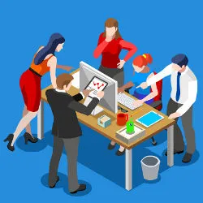

As one of my final semesters rolls to an end, I am left with yet another plethora of experiences. Though I have taken quite a number of courses this semester, ICS 414 stands out as what will be the last computer science course that I will take for a long while. Though I am only pursuing a CS minor, I felt this course truly gave me a glimpse into what really happens in the backend, and what could be a possible future for me.

## A Step Up

Having thoroughly enjoyed its prerequisite class, ICS 314, I had initially entered this course assuming that it would have a similar format, similar but advanced lessons, building upon what we learned. Instead, 414 took the last half of 314 and turned up the intensity. With a real client and a real request, we were tasked to create a website with our groups following a number of guidelines, meeting with the client regularly to assess the quality and progress of the project. This course was essentially a supervised simulation of project development in the workforce. With a real company hoping to see the fruits of our efforts, I will admit it was a little more intimidating.

## Network of Ideas

I felt that this course overall was very hands-off and independent from our instructor, most aspects of the project were decided on and delegated from within the group. We were still free to ask for advice when needed, but ultimately the structure felt very loose. Within our arranged groups, I could quickly tell that there were differences in our skill level, despite the fact that many of us were likely in the same area on our academic pathways. This made me realize a number of things. With the many people that I have met while studying CS, I could file them into two vague groups. Those who simply took the courses, worked through the assignments and exams, and those who really had the passion and took the initiative to do more than just what was assigned of them. I felt like those in the latter group really thrived in this course. A lot of the requirements for the project were not taught explicitly, rather we were challenged to come up with solutions and code processes that could accommodate the tasks. Those who took advantage and initiative were able to glean the most from this class; not much else is better than first-hand experience with project building. Through the milestone meetings, we could also observe what other groups had produced as their solutions, and share ideas amongst each other for how to improve our sites. 

## A Rich Web

Along with borrowing ideas and information between groups, as an individual, I was able to learn a lot just from my own group. I do not think that my coding abilities are anything to be super proud of. I occasionally have a breakthrough but I find that I can make things overcomplicated. So when I took a look at my groupmates’ code and saw how streamlined everything was, I found myself referencing their code when I was working and fixing things as I went. Perhaps, someone in my group was able to learn something from my own code as well. In many parts of our project, our group used different imports and packages that I was not even aware of, and I was able to look up the documentation and learn how to use it. Aside from making the project better, I was able to make a mental note of them to use in future endeavors. That is just another advantage when working with a team, there are good habits and tips to pick up from each other, ones that make us better coders as a whole.

Our goal certainly was not easy, and we poured hours over how to display the projections, how to write the formulas and calculations for the sheets, even how to format the sheets for customers to import, edit, and view. We may not have been able to fulfill all of the requests of the client, but what we learned and accomplished here is something that I nonetheless am proud of. Not only do I value the experience that this offered, but I know that it will be a great reference in the future, and possibly even a project that we could keep tinkering with as years go by and we gain more knowledge. In hindsight, as the last course in my CS minor pathway, I felt that this was a fitting and challenging class to end on.

