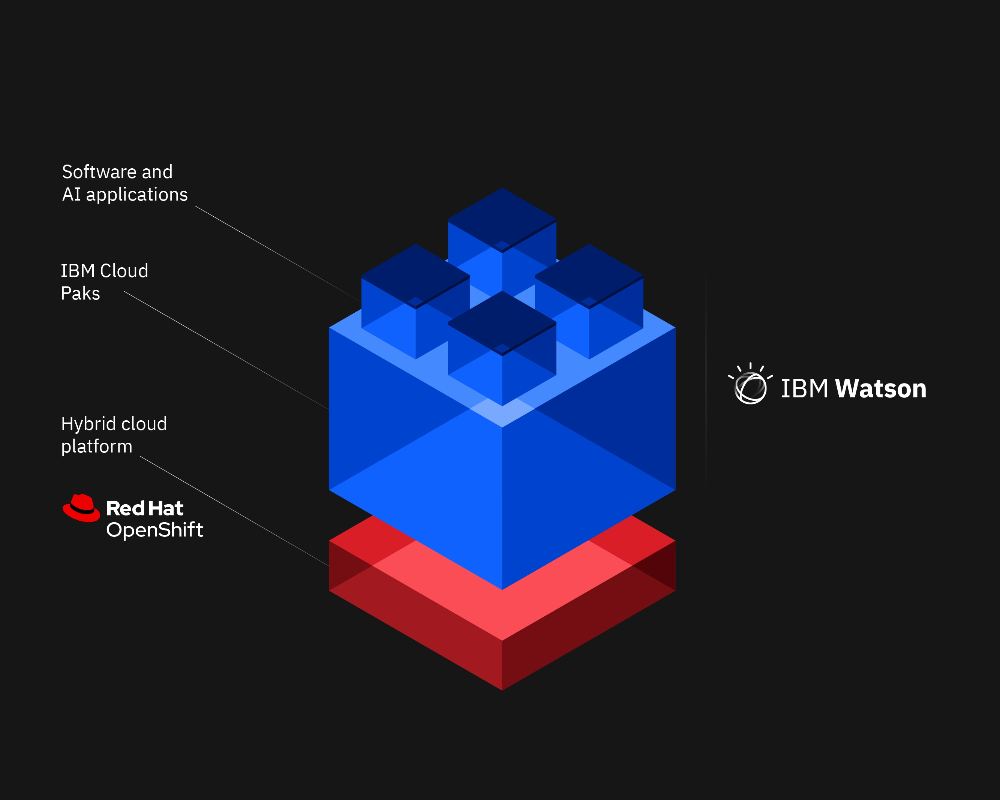

*“The purpose of education is to turn mirrors into windows.”*

I come from a family that was very technology-oriented, there was always a computer or some sort of device present. Some of my earliest memories were of online games that I can still remember the name of, and sometimes I scour the internet trying to find these games and pick up pieces of nostalgia. My father was a software developer and worked at IBM, my oldest sister pursued social work but switched to CS and is now working very successfully. My other sister, despite not following CS, builds PCs and picks up different components to upgrade them when she can. Although I have such a techy family, I follow my mother; I am still very bad with computers. 

Since childhood, I knew my major would be in Biology. I wanted to do research with microbes, plants, and animals, looking for cures or solutions that would make the world safer and better. My interest in CS started off small and later in my life. I simply thought code looked cool and smart, and I wanted to look cool and smart. I joined the Computer Science Club at my high school and learned basic Java code. I took up an interest in cryptography and ciphers, just for the fun of it. I never thought of it being my career, but rather as an interesting hobby that I wanted to improve. This thought process followed me through graduation, and in college is where I learned about the interdisciplinary potential of Biology and software development.

It was a way to combine my love for Biology and my hobby, and I jumped at that chance. Having taken several semesters of ICS courses at UHM, I am slowly building up my sufficiency in different languages. I hope that as I continue my academic career, I can slowly move towards more specialized courses, more ways in how I can implement CS and Software development/design into my Biology work. Utilizing my own programs to run PCR or writing software that will analyze DNA bands on a gel plate, they are all possibilities that I would like to explore.

I feel that in comparison to Biology, Computer Science takes a completely different part of the brain for solutions. It's harder thinking, there are multitudes of different answers and approaches to a single problem, and it's very unlikely that two people will have the same answer. In the end, my passion is still for Biology. But I can't say that I haven't enjoyed the journey that CS has taken me on, and that I'm not grateful for the things that I have learned. 
 
