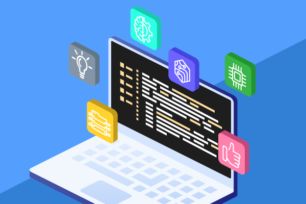

## Unexpected Gold

  When working through college, everyone tells you that it’s a time to try new things, discover your passion, and start to carve out your place in society. It’s a time to have fun, to work hard, to learn not just from your professors but also from your peers. You come to discover that in stepping out of your comfort zone, you end up with a lot of hits or misses. Maybe that course on Philosophy wasn’t your thing, or that Cross-Country club _really_ wasn’t for you. Your professor was super sweet, but an awful lecturer, or you passed a class but didn’t learn anything. There are so many factors that dictate how your experience will be, and no matter how hard you try, sometimes it will just leave you feeling unfulfilled. However, every now and then, you have the honor to chance upon an experience that hits just right. And that is how I felt about this unassuming course on Software Development that I took in my junior year.
	I honestly came into this course a bit afraid; I had no prior experience with web development, HTML, Javascript, CSS, or any of it. I was afraid that I would go through this course and come out with nothing. But this class felt so densely rich with material, it was almost impossible to _not_ learn something. In just 5 months and 20+ modules later, I can say with certainty that this has not just improved my skills in software engineering, but has given me a deep-rooted understanding in many aspects of computer science in general. 

## Connected in All Points

  One of the biggest concepts and challenges for myself was the use of User Interface Frameworks. Coming straight out of learning C/C++, the UI designs that we implemented were rather archaic. Once we entered Javascript and HTML, there was a slight improvement in what we could create, but still extremely outdated by today's standards. This is where UI Frameworks enters. Functioning like a library of useful tools to import, UI Frameworks presented a heavy learning curve with a lucrative result. Using Bootstrap, a popular framework used by many, we were able to elevate our web designs for our users tremendously, coding components that I cannot even think of how to begin creating. The documentation for Bootstrap was all completely online, free and accessible to anyone. I think that is such an integral part of modern software development, and something that is underappreciated.
	Open Source Software was something that completely changed the playing field of computer programming and something that I completely overlooked until this course. I think it is incredible that we have the ability to utilize these resources at no cost. Especially from the viewpoint of a Biology major, where my day to day is surrounded by absurdly expensive machines to carry out my work. Machines that I could not dream to ever purchase, and I have to remind myself that it is a privilege that I can use them. Yet these machines that I use was likely coded using these same open source resources! With just a laptop or device, you have so much at your disposal thanks to those who worked hard to provide these tools. 
	
   Though this is just a handful of my ranting revelations from this class, I do want to emphasize that this was an experience I don’t think I will forget. It’s hard to find something like this, one that really makes you think back on it all afterward. I never saw myself entering software engineering until this course, where I found myself doing extra work just because I was having fun. At the endings of this course, I found the potential beginnings of a new path. 
