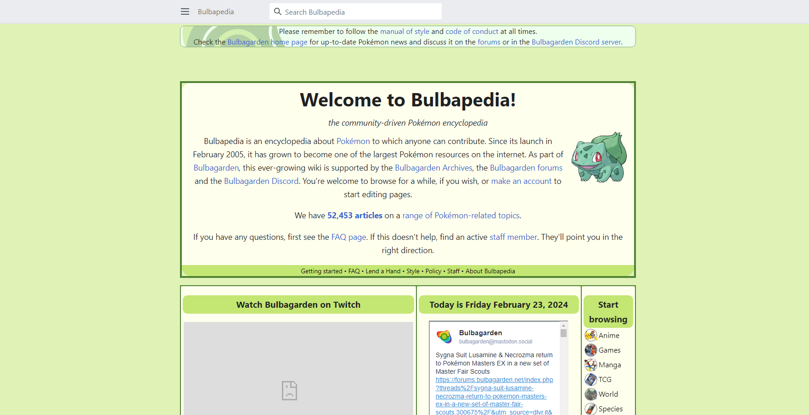
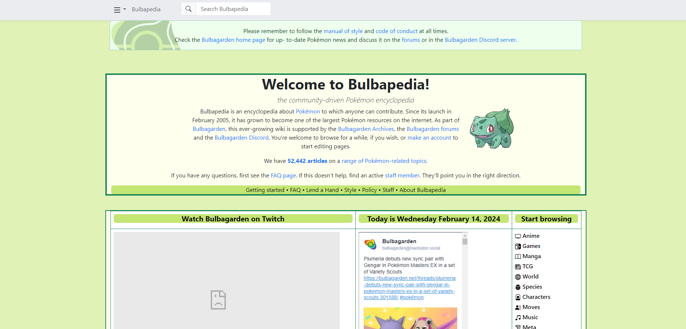

When creating a project, there are times when we realize our goal can be achieved quicker by repurposing and adding onto some old code that we’ve written before. Perhaps a search system or a sorter; we copy that block of code over, tweak it a bit, and it saves time on a whole chunk of the project. If you know your code really well, you may opt to rewrite it yourself, but it can be tedious implementing the same thing over and over for different projects. When working with a deadline, this practice comes in handy. 

## HTML & CSS

Web design with basic HTML is easy enough to pick up even if you are a beginner, though there is little room for visual development. CSS allows slight improvements visually and organizationally, and makes a fine website, but with just the two, things could end up looking somewhat archaic and uninteresting. This is fine if a simpler design is what you are going for, but it is unlikely to draw anyone in. If your goal is advertising a product or garnering attention in the modern age, “old” looking websites also strike many as malware or scams. Further attempts to make something visually appealing can take a lot of effort with extra coding of components. Thankfully, this extra code has already been taken care of by someone else, and is readily accessible for the public to utilize as UI frameworks.

## Bootstrap UI Framework

Similar to Java and many other languages that can import classes/libraries, UI frameworks are just a package of premade items for you to utilize. Sure, everything in there could be coded by hand if that is what you prefer. But why waste that time reimplementing what has already been created? There’s no reason to reinvent the wheel. Even if you wanted to, it's nicer to start off with a template or an idea rather than completely from scratch. When first getting started with UI frameworks, there can be a bit of a learning curve. With Bootstrap being the first UI framework I utilized, I found that understanding what the different components can do, how they work, and how to modify them takes trial and error. This is very likely the case for other frameworks as well. There is a lot of cross-referencing with the documentation that might need to be done, sometimes it can also be beneficial to rip a piece of example code off the documentation itself and tinker with it to observe exactly how it reacts to different modifications. Replicating a chosen site demonstrated above is also a good exercise for learning the fundamentals.

### Replicating Sites

_Original Bulbapedia Site_

_Replicated Bulbapedia Site with Bootstrap React and Meteor_

The extra effort needed to learn UI frameworks in return offers invaluable potential for any website that you design. It is an investment of time that, once familiar, gives you the tools for a clean design for lower effort. Many frameworks also offer the benefit of responsiveness, making your website as clean-cut and accessible as it is from device to device. The popularity of these frameworks attests to their practicality and applications, and have sprouted many different versions, such as React, jQuery, Ember, etc. It gives you the scaffolding and allows you to fiddle with it, add onto it as you please, and for some they would say that is the essence of programming.
