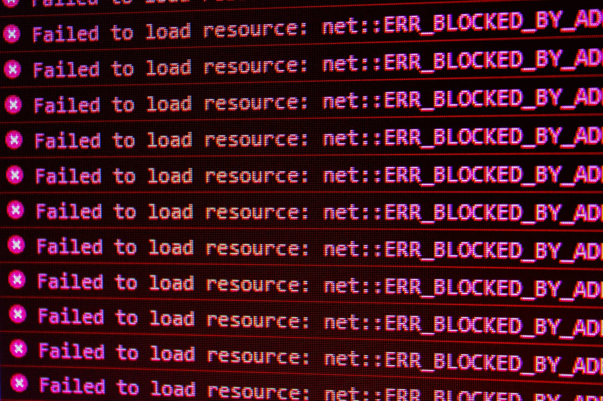

## A Trick Question 
In college, I once took a coding language class that focused mainly on C and C++. Before we had gotten into any real coding with the Unix platform or C, our professor gave us a quiz. Most of it was simple material, basic concepts that should be known and sample code to determine the outcome. All of the students breezed through it quickly, and within 10 minutes everyone was done. 

Upon reviewing said sample code as a class, nearly all of the students realized that they received a 0 for that question. Though no one could give an answer why when the professor asked. I still remember the code. It was a straightforward nested for-loop with print statements, questioning what the console would print once the code was run. It turns out the issue was coding style. With a couple of indents and oddly placed brackets, the code had the whole class fooled into thinking the loops would ever run. This example stuck by me, as the error was so small and so obvious once pointed out, it shocked you that anyone actually fell for it. Yet, it cost everyone a chunk of their score. 

It’s times like these, when you're caught off guard, skimming code, tired from staring at code, simple errors and mistakes resulting from coding style are easy to miss. Furthermore, other than causing issues for you, inconsistent style can make things more difficult for collaborators in your field to read and understand your code, leading to misunderstandings and time loss. Similar to visiting someone’s home; they may know where everything is, but it will take some for you to get used to, even worse when things are not organized in a logical way. Coding standards aren’t something that is required by the compiler. It makes no difference to the CPU where you put your brackets or how you indent your code, your whole program can be written on one line if you truly wish to. Though doing such would frustrate those around you immensely. For the CPU, as long as it is correct, it will understand it as so. Coding standards and style was created to make things easier for our eyes, to read and distinguish bodies of code efficiently, so it would do well on us and others to make following this standard a habit.

## An Appreciation for Style Checkers
When I was still taking that coding course, there was a huge disparity between what I knew and what I was going to know. Having come straight out of Java with the Eclipse IDE, the Unix platform we utilized was a completely different environment to tackle. Writing code with vi was visually similar to writing on notepad; there was little to no indication of errors in your code until you compiled, a far cry from how Eclipse would practically scream at you for any mistakes it thinks you made. C does exactly as you tell it, any errors in the code that you missed are tedious to fix. Unsurprisingly, this was not ideal, and an optional program was even written to style-check your code for you on Unix. Being stubborn, I never took the extra step to install the program. Thus, despite picking through the code for hours, looking by eye for errors, every assignment returned with a -1 for style. This highlights the importance of analysis tools like ESlint, able to catch things that you gloss over.

When it comes to Javascript, a language that I think encourages a lot of individuality in style, basic coding standards should still be followed, if not even more so. Having so many different ways to carry out the same functionality, ensuring what you can to be consistent can aid your brain in understanding the code when you return to it or when collaborating with others. JS was my fourth language after C/C++; having experienced what no style checker is like makes you so much more grateful for the many errors that style tools throw out, even small ones. Everything is overall cleaner, and after frequent exposure to what good standardized code looks like, you eventually gain an eye for it as well.
