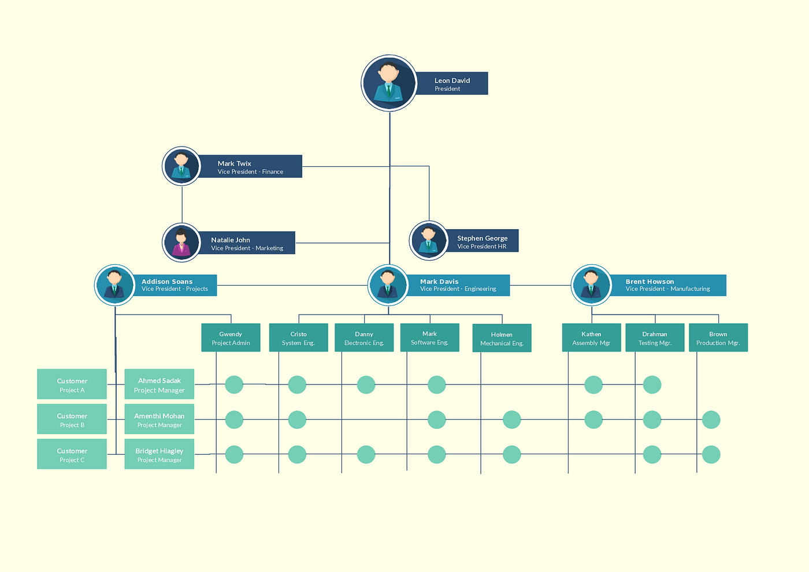

When you first try your hand at code, whether it be in school or as a hobby, you tend to see a lot of the same exercises used as practice or as the daily puzzle. Experienced coders all have come across these problems themselves and likely know what I am referring to; “search through this array and find this element”, “write some code to swap these two elements in the array”, “sort through this array from min to max”, etc. These are all staples that most coders within their first year have some sort of experience with solving. When asked, they immediately start thinking about search algorithms such as binary search or linear search, sorting algorithms such as bubble sort or merge sort, using some sort of solution that has already been solidified in their minds and in the community. Because of how common these problems are, there is a plethora of documentations reviewing and comparing the functionality and efficiency of the solutions, listing their pros and cons, and providing the basic code for each of the algorithms.

In a way, design patterns are similar to these common coding problems. Both made as a general, reusable, and customizable solution to common problems, design patterns takes it a step further, adopting a more organized and blueprint approach rather than just plain code. Design patterns can also be more team-friendly and offer a lain foundation for the different sections of work that may come with a larger or group project. Because of its adaptability and common usage, it's possible that you’ve already been using design patterns without realizing it. 

## The Hidden Framework
Having started coding in high school, this concept did not come up once in any of the courses or coding projects that I’ve taken part of. Yet, I found that as I read more into it, it has been present in every one of my works. It may have started as a suggestion for some base organization, a design pattern that made sense for a particular project, yet was so adaptable that I could use it for many others. After using it as a base for so long, it just became second nature and less of a specific concept. 

The MVC design pattern, or Model-View-Controller is something that I found frequently in my previous works, including the Bank Records experience listed in my profile. It consists of a database [Model], UI [View], and the Controller, which links the database and UI together seamlessly. Already, you can see how the project can be split into chunks and ultimately connected to form the final product. The UI was the first to be taken care of in this project, which allowed the users to interact with the application and the then unfinished database and specify what actions they wanted to carry out. After working through the database and setting up the necessary data, it only took a couple more connections for completion.

This example was just one type of design pattern, and yet there are even more within the other unmentioned projects. Design patterns offer somewhere to start off so that you aren’t just coding in the dark, unsure where to begin. They offer a level of organization that can be extrapolated into projects of many sizes, which makes them a valuable tool in all software development.
