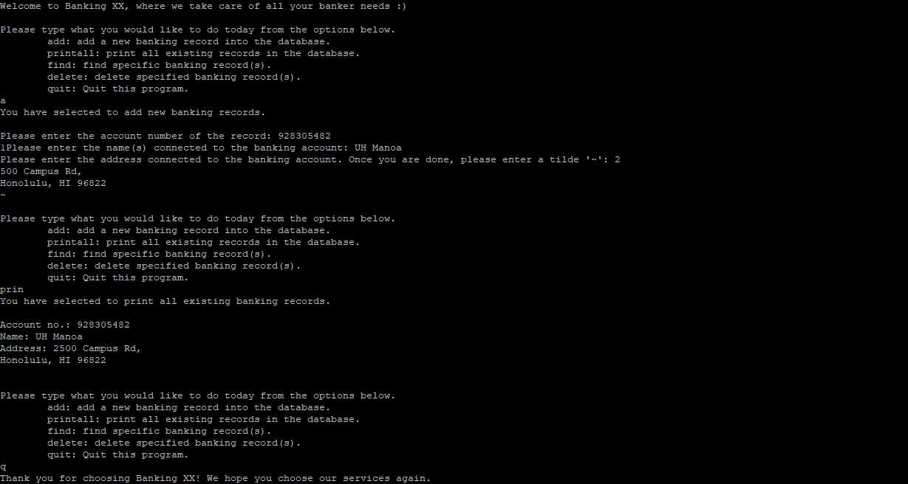

As a mid-semester project assigned to test our capabilities in all of the major concepts of C, we were instructed to create a banking program complete with a simple user interface and database. The user interface had to allow users a selection of adding records, deleting, finding, printing all of the recorded records, or quitting the program. The program also had to "save" previous records from different sessions by writing the records to a file before quitting, and reading the contents when the program is run. The project also had a built-in debug mode, toggled through the command line. The debug mode would print the functions running in the background as well as any information that was passed to said functions. Overall, the project covered pointers, structures, dynamic/static memory allocation, global/local variables, file manipulation, etc.

This project was relatively larger than most other assignments, and had to be tackled in chunks with frequent testing in between. I developed a plan of test cases, continuously adding new tests as more edits were made, making sure that each of the earliest tests passed before moving forward with coding. The user input needed to accept half-written words like "del" as "delete", "pr" as "printAll", but reject any typos or unnecessary additional letters to the keywords like "add*ing*" for "add". When prompted for information of banking records, the program needed to give specific and unique answers to any mistakes the user may make such as creating a negative banking record, or searching for a record that doesn't exist. Eventually, the test cases stretched to 150+ cases. Developing this process has made this project and will make other, potentially larger projects much easier to break down.

The repo can be found [here](https://github.com/ehsuGit/Project1Bank). Below is a snippet of the code from the User Interface file:

```C

int main(int argc, char* argv[])
{
    struct record * start = NULL;
    struct record ** pstart = &start;
    int select = -1;
    int quit = 0;
    int i;
    char filename[] = "savedrecords.txt";
    if (argc > 2)
    {
        debugMode = 0;
        quit = 1;
        printf("No such file or directory\n");
    }
    if (argc == 2)
    {
        int length = strlen(argv[1]);
        if (length == 5)
        {
            if (strcmp(argv[1], "debug") == 0)
            {
                debugMode = 1;
                printf("DEBUG MODE ON\n");
            }
            else
            {
                debugMode = 0;
                quit = 1;
                printf("No such file or directory\n");
            }
        }   
        else
        {
            debugMode = 0;
            i = 10;
            quit = 1;
            printf("No such file or directory\n");
        }
    }
    if(quit == 0)
    {
        printf("Welcome to Banking XX, where we take care of all your banker needs :)\n");
    }
    readfile(pstart, filename);
    while(quit == 0)
    {
        char menu[20];
        char trash[80];
        select = -1;
        printf("\nPlease type what you would like to do today from the options below.\n");
        printf("\tadd: add a new banking record into the database.\n");
        printf("\tprintall: print all existing records in the database.\n");
        printf("\tfind: find specific banking record(s).\n");
        printf("\tdelete: delete specified banking record(s).\n");
        printf("\tquit: Quit this program.\n");
```
