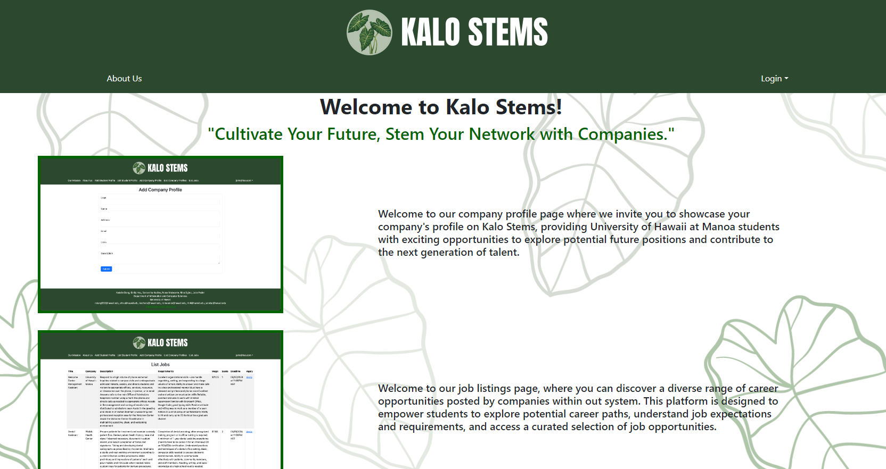

[Kalo Stems](https://kalo-stems.github.io/) is a [webpage]((http://146.190.131.126/)) designed in my college Software Engineering course as a final project with the combined efforts of the Kalo Koders; [Samantha Kocher](https://samanthakocher.github.io/), [Roma Malasarte](https://romamalasarte.github.io/), [Rina Ogino](https://rinaogino.github.io/), [Jaira Pader](https://jairabp.github.io/), [Natalie Dang](https://ndang562.github.io/), and myself. The idea of Kalo Stems was to create a platform where UHM students could connect with companies and career opportunities that are tailored to their interests and skills. In our final product, we produced a site where students and companies could register an account and create their own portfolios for other fellow users to interact with, and companies could list new job opportunities for students to consider.

This project utilized Issue Driven Project Management (IDPM) which was what I thought to be a very organized and sensible way to break up a monumental task into digestable ones. Each chunk of work was broken into separate "issues", where the work for that specific portion would be done in an appropriately named branch. Everything was tested to check functionality before merging into the main branch. Each issue could be picked up by any group member, and our project board always had ample free issues for a member to claim once they finished their own. Within the project, I contributed to the job listings pages, as well as some work in creating roles for companies and students.

Though overall some of our original ideas for the application fell through, this project was an amazing experience that was an introduction to large-scale project development with a big group, and a foundation for something that can be tinkered with after gaining more knowledge. With most of my projects being solely my own work at the time, this was a huge change of pace that involved delegating tasks to each group member, holding frequent meetings to check progress, and learning compromise with the limits of our abilities. Merge conflicts were something that I had not had problems with working on my own at the time, and since completing this project I've had plenty of practice. The design of IDPM is also something that can be extrapolated into other aspects in life and applied to other projects. This project was just a small stepping stone that lent a glimpse of what project development in real companies was really like.
